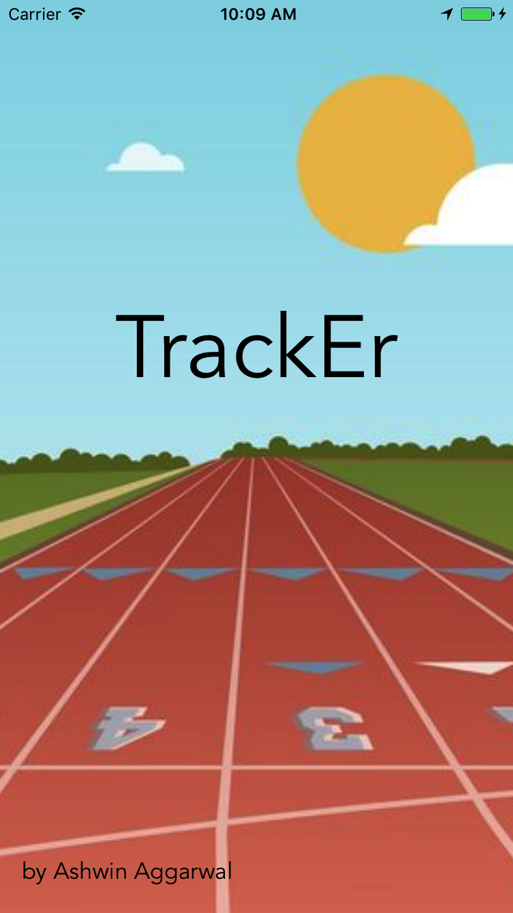

<h1>TrackEr</h1>

TrackEr is intended for coaches that seek an easier way to communicate with their athletes. TrackEr implements several functionalities that coaches would use on a daily basis: timer, stopwatch, list of athletes, and instant text-message functionality. Whether you’re recording the splits of a workout or timing a core exercise, TrackEr helps coaches send updated times and records to athletes.

<h3>Requirements</h3>

<ul>
	<li>Built for iPhone 6 and iPhone 7</li>
	<li>Requires XCode 8.2.1</li>
</ul>

<h3>Screenshots</h3>

<img src="Screenshots/timer.png" width="400"
<img src="Screenshots/stopwatch.png" width="400"
<img src="Screenshots/book.png" width="400"
